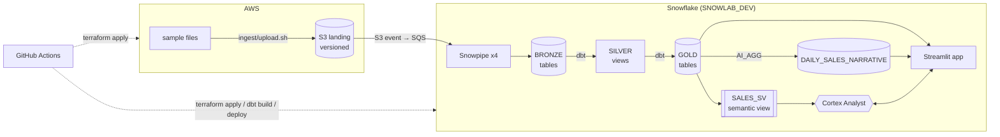
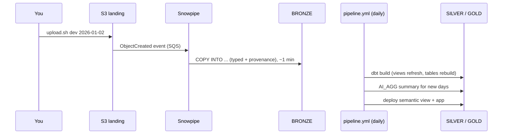

# 1. Architecture

## Mental model

Three planes, each with one job:

| Plane | Job | Built with |
|---|---|---|
| **Data** | Turn delivered files into trusted answers | S3 → Snowpipe → bronze → dbt → silver/gold |
| **Control** | Create and change everything the data plane runs on | Terraform + GitHub Actions |
| **Consumption** | Let people see and ask about the data | Streamlit, semantic view, Cortex Analyst, Cortex AI |

Everything is code in one repo. Nothing is clicked into existence (except a one-off bootstrap).

## End-to-end flow



## Medallion layers

| Layer | Snowflake object | Rule | Owned by |
|---|---|---|---|
| **landing** | S3 prefix `<env>/ecommerce/<feed>/<date>/`, external stage `LANDING.ECOMMERCE` | Delivered files, never edited in place without a reload. Versioning = audit trail | You (uploads) |
| **bronze** | Tables `BRONZE.<FEED>` | Mirrors landing 1:1 per file. Typed, plus provenance (`_src_file`, `_src_row_number`, `_src_file_checksum`, `_src_file_modified`, `_loaded_at`). Append-only per file | Terraform (DDL), Snowpipe (rows) |
| **silver** | Views `SILVER.<FEED>` | Thin, lossless: latest file (dimensions) or latest file per day (transactions). No joins, no business rules | dbt |
| **gold** | Tables `GOLD.*` | Business logic: joins, `is_completed`, aggregates, AI narrative | dbt |

Why it matters: if you disagree with silver or gold, you can always rebuild from bronze; if bronze is wrong, rebuild from landing.

## Life of a file



**Corrections**: overwrite the file in S3, then as `SYSADMIN`: `CALL SNOWLAB_DEV.BRONZE.RELOAD_FILES('<feed>', '.*<feed>/<date>/.*[.]csv')`. It loads the new version and removes older loads of the same file in one transaction.

## Infrastructure

| Where | What | Stack |
|---|---|---|
| AWS | Terraform state bucket | `bootstrap/aws` (run once) |
| AWS | Budget + SNS email alerts · GitHub OIDC provider + `ci` role · landing bucket | `terraform/aws` |
| AWS | IAM role Snowflake assumes (read `dev/` only) · S3 → Snowpipe notification | `terraform/snowflake/env` |
| Snowflake | `TERRAFORM_SVC` user, `TERRAFORM_WH` | `bootstrap/snowflake` (run once) |
| Snowflake | Account credit cap (50/mo), Cortex cross-region | `terraform/snowflake/account` |
| Snowflake | Warehouse + monitor, database + schemas, roles, deploy user, integration, stage, bronze, pipes, `RELOAD_FILES` | `terraform/snowflake/env` |

## Who does what (identities)

| Identity | Kind | Can | Used by |
|---|---|---|---|
| You | SSO (AWS), personal user (Snowflake) | Admin | Bootstrap, uploads, break-glass |
| `snowflake-lab-ci` | AWS IAM role via GitHub OIDC | Manage `snowflake-lab-*` resources | `terraform.yml` |
| `TERRAFORM_SVC` | Snowflake service user (key-pair) | SYSADMIN / SECURITYADMIN / ACCOUNTADMIN | `terraform.yml` |
| `SNOWLAB_DEV_DEPLOY_SVC` | Snowflake service user (key-pair) | Role `TRANSFORMER`: read bronze, build silver/gold, deploy app | `pipeline.yml` |
| `snowflake-lab-dev-snowflake-s3` | AWS IAM role, trusted by Snowflake | Read `s3://<bucket>/dev/` | Storage integration |
| `SNOWLAB_DEV_ANALYST` | Snowflake role | Read gold, use app, Cortex | People |

## The use case

E-commerce sales analytics on 4 synthetic feeds (transactions, customers, products, campaigns), 7 days:

1. **Dashboard**: KPIs, revenue by day/hour/category/channel/tier, top products.
2. **Ask the data**: plain-English questions → Cortex Analyst → SQL → answer.
3. **Daily AI summary**: 3 sentences per day for a store manager, written by Cortex `AI_AGG`.

## Repo map

```
bootstrap/        run-once admin setup (state bucket, TERRAFORM_SVC)
terraform/        aws | snowflake/account | snowflake/env
dbt/              silver + gold models, semantic view macro
streamlit/        app + snowflake.yml + environment.yml
ingest/           upload.sh (files → S3)
data/sample/      7 days of synthetic files
scripts/          CI helper, secret sync, GitHub hardening, ask.sh, nuke.sh
.github/workflows terraform.yml (infra) · pipeline.yml (dbt + AI + app)
```
