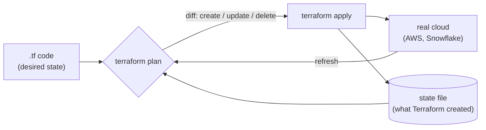
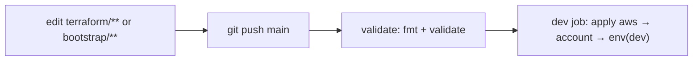

# 2. Terraform (infrastructure as code)

## Mental model



- **Code** says what should exist. **State** remembers what Terraform created. **Plan** = the diff. **Apply** = make it so.
- *No changes* on plan means code == reality. That is the health check.
- **Providers** are plugins that talk to an API: `hashicorp/aws`, `snowflakedb/snowflake`.

## Stacks (one state each)

| Stack | State key | Manages | Why separate |
|---|---|---|---|
| `bootstrap/aws` | `bootstrap/aws.tfstate` | State bucket | Must exist before any backend. Applied with local state, then migrated into itself |
| `terraform/aws` | `aws.tfstate` | Budget + alerts, GitHub OIDC + `ci` role, landing bucket | Account-wide AWS |
| `terraform/snowflake/account` | `snowflake/account.tfstate` | Account resource monitor, Cortex cross-region parameter | Account singletons: per-env stacks must not fight over them |
| `terraform/snowflake/env` | `snowflake/<env>.tfstate` | Everything per environment (below) | Destroying DEV can never touch PROD |

All state lives in `s3://snowflake-lab-tfstate-<account_id>` (versioned, encrypted, `use_lockfile` locking).

## What `snowflake/env` creates (DEV)

| File | Resources |
|---|---|
| `main.tf` | Warehouse `SNOWLAB_DEV_WH` + monitor `SNOWLAB_DEV_RM` · database `SNOWLAB_DEV` · schemas `LANDING BRONZE SILVER GOLD APP` |
| `roles.tf` | Roles `SNOWLAB_DEV_ANALYST`, `SNOWLAB_DEV_TRANSFORMER` + grants (incl. future grants) |
| `users.tf` | `SNOWLAB_DEV_DEPLOY_SVC` (`TYPE = SERVICE`, key-pair) |
| `ingestion.tf` | Storage integration ↔ IAM role · stage · file format · 4 bronze tables · 4 pipes · S3 notification · `RELOAD_FILES` |

Key techniques:

| Technique | Where | Why |
|---|---|---|
| Provider aliases per role (`SYSADMIN` default, `securityadmin`, `accountadmin`) | `providers.tf` | Least role per resource |
| One `feeds` map generates table DDL, pipe COPY and `RELOAD_FILES` | `ingestion.tf` locals | One source of truth for columns |
| Own `storage_aws_external_id` | integration | IAM trust in a single apply |
| `snowflake_execute` + `CREATE OR ALTER TABLE` | bronze tables | In-place schema changes; destroy never drops data |
| `preview_features_enabled` | provider | Pipes and SQL procedures are preview resources |

## Authentication

| | Locally | In CI |
|---|---|---|
| AWS | `AWS_PROFILE=<sso profile>` | GitHub OIDC → `snowflake-lab-ci` (no keys) |
| Snowflake | `set -a; source terraform/snowflake/.env; set +a` (`SNOWFLAKE_*` + key) | Same `SNOWFLAKE_*` vars from GitHub secrets |
| Config (`backend.hcl`, `*.tfvars`) | Gitignored files | GitHub secrets, synced by `scripts/sync-ci-secrets.sh` |

## How changes flow



`scripts/ci/tf-apply.sh` plans to a file, prints **only counts and resource types** (public logs), and **applies** if there are changes. Locally, run `plan` freely; `apply` (and `tf-apply.sh`) is break-glass.

```bash
export AWS_PROFILE=<sso profile>; set -a; source terraform/snowflake/.env; set +a
terraform -chdir=terraform/snowflake/env init -reconfigure \
  -backend-config=../../backend.hcl -backend-config="key=snowflake/dev.tfstate"
terraform -chdir=terraform/snowflake/env plan -var-file=dev.tfvars   # expect: No changes
# Break-glass only (APPLIES changes; run from repo root, needs jq):
# scripts/ci/tf-apply.sh aws
```

## Validate resources

| Resource | CLI | Web UI |
|---|---|---|
| State bucket / landing bucket | `aws s3 ls`; `aws s3api get-bucket-versioning --bucket <b>` | S3 console → bucket → Properties |
| Budget + alerts | `aws budgets describe-budget --account-id <id> --budget-name snowflake-lab-monthly` | Billing → Budgets |
| CI role trust | `aws iam get-role --role-name snowflake-lab-ci --query Role.AssumeRolePolicyDocument` | IAM → Roles → Trust relationships |
| Warehouse + monitor | `snow sql -c <conn> -q "SHOW WAREHOUSES LIKE 'SNOWLAB%'"`; `SHOW RESOURCE MONITORS` needs `--role ACCOUNTADMIN` | Admin → Warehouses / Cost management |
| Database, schemas, tables | `SHOW SCHEMAS IN DATABASE SNOWLAB_DEV` | Catalog → Database Explorer |
| Roles + grants | `SHOW GRANTS TO ROLE SNOWLAB_DEV_TRANSFORMER` | Admin → Users & Roles |
| Integration | `DESC INTEGRATION SNOWLAB_DEV_S3_LANDING` | Catalog → Integrations (or SQL) |
| Pipes | `SHOW PIPES IN SCHEMA SNOWLAB_DEV.BRONZE`; `SELECT SYSTEM$PIPE_STATUS('SNOWLAB_DEV.BRONZE.TRANSACTION_PIPE')` | Database Explorer → BRONZE → Pipes |
| Load results | `SELECT * FROM TABLE(SNOWLAB_DEV.INFORMATION_SCHEMA.COPY_HISTORY(TABLE_NAME=>'SNOWLAB_DEV.BRONZE.TRANSACTION', START_TIME=>DATEADD(day,-7,CURRENT_TIMESTAMP())))` | Monitoring → Copy History |

## Teardown

`AWS_PROFILE=<admin> SNOW_ADMIN_CONN=<accountadmin conn> scripts/nuke.sh --dry-run` (needs `terraform/snowflake/.env`) shows what goes; without the flag it destroys in reverse order: env → account → empty landing → aws → bootstrap user/warehouse → state bucket (last, it is the record of everything).
