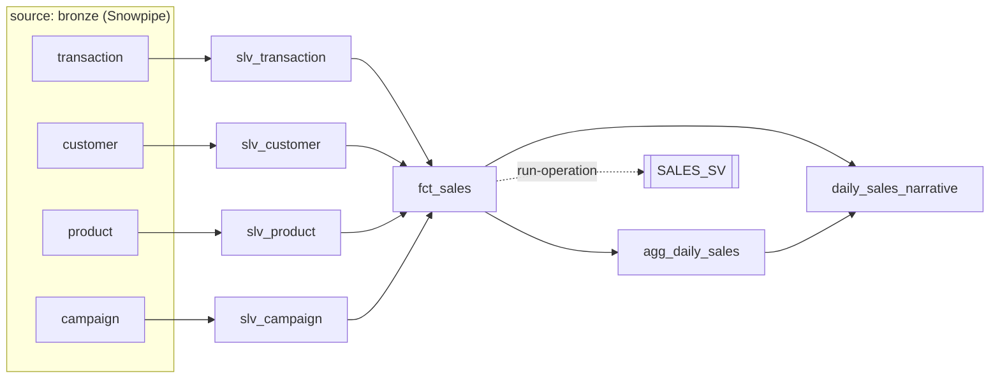

# 3. dbt pipeline

## Mental model

A dbt **model** is a `SELECT` in a file. `ref()` / `source()` connect models into a **DAG**; dbt runs them in order and **materializes** each as a view or table. You never write `CREATE`; dbt does.



| Layer | Model | Materialized | Relation |
|---|---|---|---|
| silver | `slv_*` | view | `SILVER.TRANSACTION` / `CUSTOMER` / `PRODUCT` / `CAMPAIGN` |
| gold | `fct_sales` | table | `GOLD.FCT_SALES` |
| gold | `agg_daily_sales` | table | `GOLD.AGG_DAILY_SALES` |
| gold | `daily_sales_narrative` | incremental | `GOLD.DAILY_SALES_NARRATIVE` |
| gold | macro `deploy_semantic_view` | (DDL) | `GOLD.SALES_SV` |

## Project layout

```
dbt/
├── dbt_project.yml          silver → view, gold → table (+schema)
├── profiles.yml             connection from env vars only (DBT_SNOWFLAKE_*)
├── macros/
│   ├── generate_schema_name.sql   use SILVER/GOLD exactly (no prefix)
│   └── deploy_semantic_view.sql   CREATE SEMANTIC VIEW + grant
└── models/
    ├── sources.yml          bronze tables (owned by Terraform, filled by Snowpipe)
    ├── silver/slv_*.sql
    └── gold/*.sql, gold.yml (descriptions + tests)
```

The `slv_` prefix keeps model names clear (and unique across layers); `config(alias='TRANSACTION')` sets the relation name.

## Silver: pick the right rows, change nothing

```sql
with src as (
    select *, to_date(regexp_substr(_src_file, '[0-9]{4}-[0-9]{2}-[0-9]{2}')) as _file_date
    from {{ source('bronze', 'transaction') }}
)
select * from src
qualify dense_rank() over (partition by _file_date order by _src_file desc) = 1   -- latest file per day
    and dense_rank() over (partition by _src_file order by _loaded_at desc) = 1   -- latest load per file
```

- Dimensions (customer/product/campaign) are **full daily snapshots** → keep only the latest file overall.
- `_file_date` comes from the path (`dev/ecommerce/transaction/2026-01-02/...`).
- The second condition protects against a file loaded twice (Snowpipe + `RELOAD_FILES`).

## Gold: business logic lives here

| Model | Logic |
|---|---|
| `fct_sales` | One row per transaction; joins current customer/product/campaign attributes; business rule `is_completed = status = 'completed'` |
| `agg_daily_sales` | Completed sales by `order_date × channel × category` |
| `daily_sales_narrative` | Computes day facts in SQL, then `AI_AGG` writes a 3-sentence summary. **Incremental**: only days not yet summarised (`order_date not in (select order_date from {{ this }})`) |

## Setup: deploy key and connection

dbt, `ask.sh` and the Streamlit deploy run as `SNOWLAB_DEV_DEPLOY_SVC`. Once per machine:

```bash
cd ~/.snowflake/keys    # same key-pair steps as bootstrap/README.md, step 2
openssl genrsa 2048 | openssl pkcs8 -topk8 -inform PEM -out snowlab_dev_deploy_svc.p8 -nocrypt
openssl rsa -in snowlab_dev_deploy_svc.p8 -pubout -out snowlab_dev_deploy_svc.pub && chmod 600 snowlab_dev_deploy_svc.p8
# public key body -> deploy_public_key in terraform/snowflake/env/dev.tfvars, then apply (CI) + scripts/sync-ci-secrets.sh
snow connection add --connection-name snowlab_dev_deploy --account <org>-<account> --user SNOWLAB_DEV_DEPLOY_SVC \
  --authenticator SNOWFLAKE_JWT --private-key-file ~/.snowflake/keys/snowlab_dev_deploy_svc.p8 --no-interactive
cp dbt/.env.example dbt/.env   # fill in account
```

## Run it

```bash
set -a; source dbt/.env; set +a        # account, deploy user, key path, DBT_PROFILES_DIR=.
cd dbt
dbt debug                              # connection check
dbt build                              # models + tests, in DAG order
dbt build --select +fct_sales          # a model and its parents
dbt build --select daily_sales_narrative --full-refresh   # regenerate AI summaries
dbt run-operation deploy_semantic_view
```

In CI, `.github/workflows/pipeline.yml` does the same on push (`dbt/**`, `streamlit/**`), daily at 20:00 UTC, or `gh workflow run pipeline`, as `SNOWLAB_DEV_DEPLOY_SVC` with pinned dbt Fusion.

## Check results

```sql
SELECT COUNT(*) FROM SNOWLAB_DEV.GOLD.FCT_SALES;                          -- = SILVER.TRANSACTION rows
SELECT SUM(net_revenue) FROM SNOWLAB_DEV.GOLD.AGG_DAILY_SALES;            -- = completed net in FCT_SALES
SELECT order_date, summary FROM SNOWLAB_DEV.GOLD.DAILY_SALES_NARRATIVE ORDER BY 1;
```

UI: **Catalog → Database Explorer → SNOWLAB_DEV → GOLD** (data preview, lineage tab), **Monitoring → Query History** (filter user `SNOWLAB_DEV_DEPLOY_SVC`).

## Add a model

1. Create `dbt/models/gold/my_model.sql` with `{{ config(alias='MY_MODEL') }}` and a `select ... from {{ ref('fct_sales') }}`.
2. `dbt build --select my_model` locally.
3. Push. CI builds it; `ANALYST` can read it automatically (future grants on `GOLD`).
