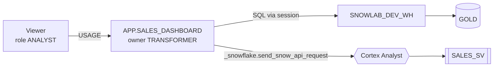

# 5. Streamlit app

## Mental model

- A Streamlit app is a Python script that **reruns top to bottom** on every click. Widgets return values; `st.session_state` keeps memory between reruns; `@st.cache_data` avoids repeating queries.
- **Streamlit in Snowflake (SiS)** hosts the script inside Snowflake: no server, no credentials. `get_active_session()` gives a Snowpark session running as the app **owner's** role (`TRANSFORMER`); viewers need `USAGE` on the app.



## Files

| File | Purpose |
|---|---|
| `streamlit/streamlit_app.py` | The app |
| `streamlit/snowflake.yml` | Deploy definition (name, `APP` schema, warehouse, `runtime_name`, artifacts) |
| `streamlit/environment.yml` | Packages: `streamlit=1.52.2` from the Snowflake channel |

**Runtime matters**: `runtime_name: SYSTEM$WAREHOUSE_RUNTIME`. Snowflake's new default (container runtime) has no `_snowflake` module, so the chat would break. The warehouse runtime's default Streamlit is old (no `st.chat_input`), hence the pin.

## Code walkthrough

| Part | What it does |
|---|---|
| Setup | `session = get_active_session()`; database from the session → works in DEV and PROD unchanged |
| `query(sql, params)` | `@st.cache_data(ttl=600)`; filters passed as **bind parameters** (`?`), never string-formatted |
| Sidebar | Date range, channels, statuses (default `completed`) → one `WHERE` clause reused everywhere |
| KPIs | Orders, net revenue, margin %, average order value (`st.metric`) |
| Charts | Revenue by day / hour / category / tier, orders by channel (`st.line_chart`, `st.bar_chart`) |
| Narrative | Reads `GOLD.DAILY_SALES_NARRATIVE` into expanders (skipped if missing) |
| Ask tab | Chat history in Analyst message format → `send_snow_api_request("POST", "/api/v2/cortex/analyst/message", ...)` → renders text, SQL, result, chart, suggestions |
| Safety | Generated SQL runs only if it is a single `SELECT`/`WITH` (the app runs as `TRANSFORMER`) |

## Deploy

```bash
cd streamlit
# connection: snowlab_dev_deploy (setup: ../03-dbt/README.md#setup-deploy-key-and-connection)
SNOW="uvx --from snowflake-cli==3.28.0 snow"; C="-c snowlab_dev_deploy --role SNOWLAB_DEV_TRANSFORMER --warehouse SNOWLAB_DEV_WH"
$SNOW streamlit deploy --replace $C
$SNOW sql $C -q "GRANT USAGE ON STREAMLIT SNOWLAB_DEV.APP.SALES_DASHBOARD TO ROLE SNOWLAB_DEV_ANALYST"
```

CI (`pipeline.yml`) does the same after `dbt build`, as the deploy user.

## Validate

| Check | How |
|---|---|
| App exists, runtime | `DESC STREAMLIT SNOWLAB_DEV.APP.SALES_DASHBOARD;` → `runtime_name = SYSTEM$WAREHOUSE_RUNTIME` |
| Deployed files | `LIST snow://streamlit/SNOWLAB_DEV.APP.SALES_DASHBOARD/versions/live/;` |
| Open it | Snowsight → **Projects → Streamlit → SALES_DASHBOARD** |
| Queries it ran | **Monitoring → Query History**, warehouse `SNOWLAB_DEV_WH` |

## Troubleshooting

| Error | Cause → fix |
|---|---|
| `No module named '_snowflake'` | Container runtime → set `runtime_name: SYSTEM$WAREHOUSE_RUNTIME` |
| `module 'streamlit' has no attribute 'chat_input'` | Old default Streamlit → pin in `environment.yml` (and list it in `artifacts`) |
| Empty answer in Ask tab | Question outside the data range (2026-01-01..07) |
