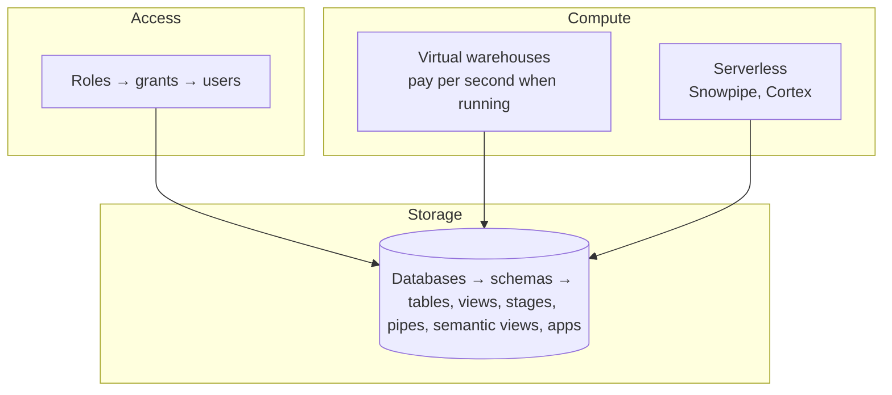

# 6. Snowflake walkthrough (Snowsight)

Snowsight menus move between releases; if a path differs, use the search bar. Switch roles from the user menu (bottom-left). To see what an app user sees, use `SNOWLAB_DEV_ANALYST`.

## Mental model



Storage and compute are separate: data costs storage; queries cost warehouse credits only while running (`AUTO_SUSPEND = 60`). Every object is owned by a role, and you see only what your role is granted.

## Tour mapped to this project

| Area | Go to | Look at |
|---|---|---|
| **Projects → Workspaces / Worksheets** | New SQL file | Run `SELECT * FROM SNOWLAB_DEV.GOLD.AGG_DAILY_SALES`. Note role/warehouse pickers |
| **Projects → Streamlit** | `SALES_DASHBOARD` | The app (dashboard + Ask the data) |
| **Catalog → Database Explorer** | `SNOWLAB_DEV` | Schemas `LANDING → BRONZE → SILVER → GOLD → APP`; table **Data Preview**, **Lineage**; `BRONZE` pipes; `LANDING` stage |
| **Monitoring → Query History** | Filter user `SNOWLAB_DEV_DEPLOY_SVC` | dbt's SQL; open one → **Query Profile** |
| **Monitoring → Copy History** | Table `BRONZE.TRANSACTION` | One row per file Snowpipe loaded, status, rows |
| **Admin → Warehouses** | `SNOWLAB_DEV_WH` | Size XS, auto-suspend 60s, resource monitor |
| **Admin → Cost Management** | Consumption | Warehouse vs serverless (Snowpipe, AI services) credits |
| **Admin → Users & Roles** | `SNOWLAB_DEV_*` | Role hierarchy graph, service users (`TYPE = SERVICE`) |

## AI & ML (step by step)

### Cortex Analyst playground

1. Role `SNOWLAB_DEV_ANALYST`, warehouse `SNOWLAB_DEV_WH`.
2. **AI & ML → Cortex Analyst** → select `SNOWLAB_DEV.GOLD.SALES_SV`.
3. Ask: *"What was net revenue by channel?"*, *"How many orders did gold tier customers place?"*, *"Compare revenue day over day in the first week of January 2026"*.
4. Expand the **SQL** under each answer and check it.
5. Open the semantic view editor to see dimensions/metrics/synonyms. Treat it as read-only: the source of truth is `dbt/macros/deploy_semantic_view.sql`, and UI edits (incl. verified queries) are overwritten on the next pipeline run.

### AI SQL in a worksheet

```sql
-- works on trial
SELECT order_date, summary FROM SNOWLAB_DEV.GOLD.DAILY_SALES_NARRATIVE ORDER BY 1;
-- aggregate in SQL first; the LLM only phrases (see Cortex AI doc)
SELECT AI_AGG(channel || ': ' || net, 'Which channel did best? One sentence.')
FROM (SELECT channel, SUM(net_revenue) AS net FROM SNOWLAB_DEV.GOLD.AGG_DAILY_SALES
      WHERE order_date = '2026-01-07' GROUP BY channel);
-- most other AI functions are blocked on trial: see ../04-cortex-ai/README.md#limits-and-settings
```

### Snowflake Intelligence / agents (optional)

**AI & ML → Agents** lets you build a chat agent with `SALES_SV` as a Cortex Analyst tool, used from the Snowflake Intelligence chat UI. Setup may create a `SNOWFLAKE_INTELLIGENCE` database and needs a role with Cortex access; availability on trial accounts varies. Not part of this repo's code.

### Other AI & ML features (not used here)

| Feature | What it is |
|---|---|
| Cortex Search | Hybrid (vector + keyword) search service over text columns, for RAG |
| Document AI / `AI_EXTRACT` | Pull fields out of PDFs/images |
| AI / LLM playground | Try models and prompts interactively |
| Cortex Code | AI coding assistant in Snowsight (may be disabled on trial) |

## Quick exercises

1. Find the 7 files Snowpipe loaded: **Copy History**, or `SELECT DISTINCT _src_file FROM SNOWLAB_DEV.BRONZE.TRANSACTION`.
2. Follow lineage from `GOLD.FCT_SALES` back to `BRONZE.TRANSACTION` in Database Explorer.
3. Switch to `SNOWLAB_DEV_ANALYST` and try `SELECT * FROM SNOWLAB_DEV.BRONZE.TRANSACTION` (denied: by design). Run `USE SECONDARY ROLES NONE` first, or your admin roles leak in.
4. Ask the same question in the playground and the app; compare the SQL.
